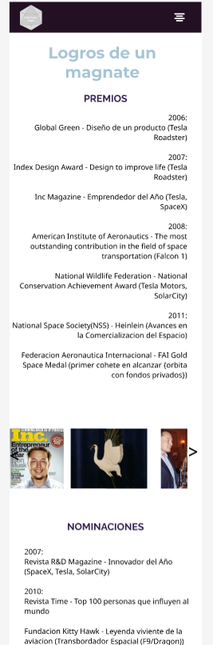

<h1> ELON MUSK</h1>

Proyecto individual

<h2 align="center">¿Por qué Elon Musk?</h2>

Decidí interesarme en él por los grandes proyectos que he visto y que se han reconocido a nivel mundial, eso me incentivó a conocer un poco más de la vida de este gran inversor y multimillonario.
  

<h2 align="center">Objetivo</h2>

 Crear una página web en el que se evidencie la información del magnate y se pueda ser de gran ayuda a los demás con su accesibilidad y fácil comprensión con la dinámica de los datos proporcionados.

  
<h2 align="center">Tecnologías Relevantes</h2>

<ul>
  <li>Diseño de Interfaz de Usuario (UI) / Experiencia de Usuario (UX)</li>
  <li>Demostración de datos analizados</li>
  <li>HTML / CSS</li>
  <li>Framework: Bootstrap</li>
  <li>Figma</li>
</ul>

  
<h2 align="center"> Conclusiones</h2>

Como nueva en el desarrollo de Frontend fue grato para mí los tipos de ayudas que ofrece el internet y los temarios de campus, pues me ayudaron a tener un tipo diccionario y orden en todo lo que se necesita para construir lo que fue mi página web. El uso del Bootstrap tengo que mejorar, pero sé cómo manejarlo y defenderme en el. Durante el recorrido de este mes pude conocer nuevas etiquetas y el uso de estas, además del uso del CSS y la importancia para darle vida al diseño UI.

  
<h2 align="center"> Diseños</h2>

<b>PÁGINA PRINCIPAL</b>

Acá podemos ver el menú responsive y y paleta de colores que se manejó, se trató de que fueran colores relacionados a la tecnología.

Empezamos con la página principal y se puede ver el fondo que fue una imagen, y las dos secciones como lo es la información primordial tipo: biografía y el apartado del Twitter personal de ELon Musk.

  
<b>PÁGINA DE EMPRESAS</b>

Esta es una subpágina que se resalta por incluir las principales empresas que Musk a fundado y también habla de las que se han comprado, todo ello junto con una descripción y una imagen alusiva a cada una de ellas.

  
<b>PÁGINA SOBRE EL PENSAMIENTO</b>

Esta subpágina nos dirige a la forma de pensar de Musk y resaltan datos puntuales que él ha comentado y compartido, además de ver un apartado con frases de él de forma dinámica.

  
<b>PÁGINA DE PREMIOS Y NOMINACIONES</b>

La subpágina de premios se divide en dos secciones como se puede ver, la primera es netamente de premios que Musk ha ganado y un carrusel de fotos de los premios. Más abajo se ven las nominaciones de revistas principalmente y un carrusel de ellas. Las dos secciones se hicieron cronológicamente para que el usuario tuviera un contexto del tiempo articulado que en el que se llevaron a cabo estos logros.

<h3>*Cabe resaltar que pocas cosas fueron modificadas durante el proceso de creación.</h3>